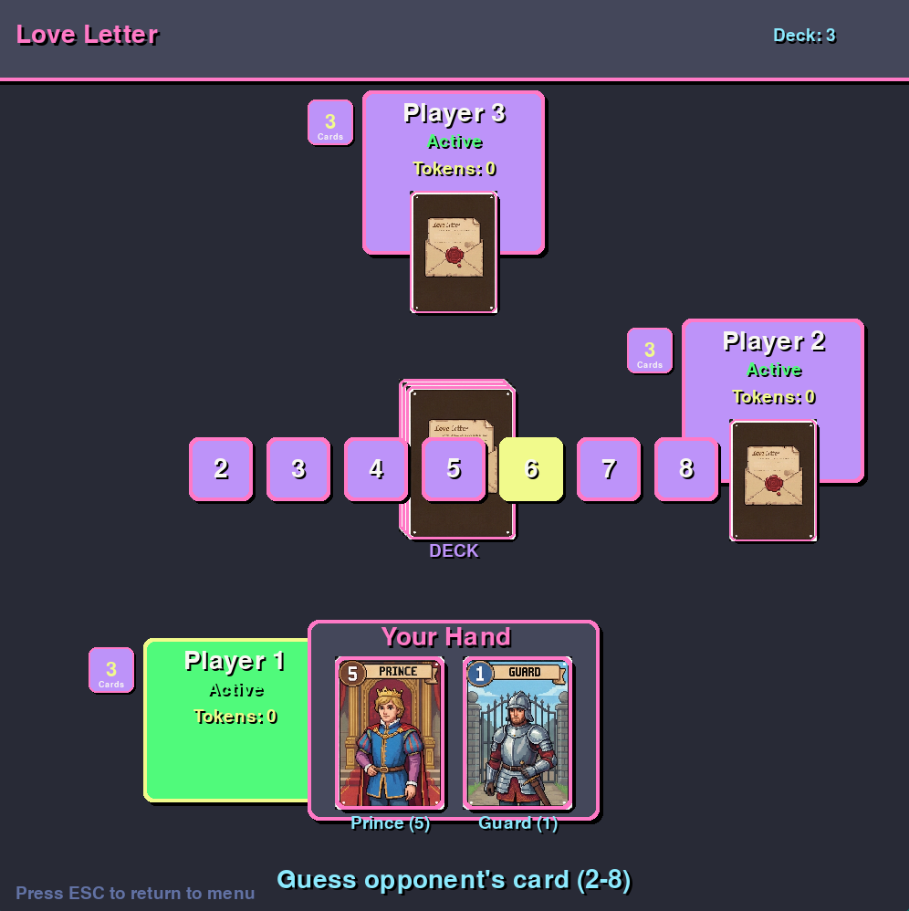
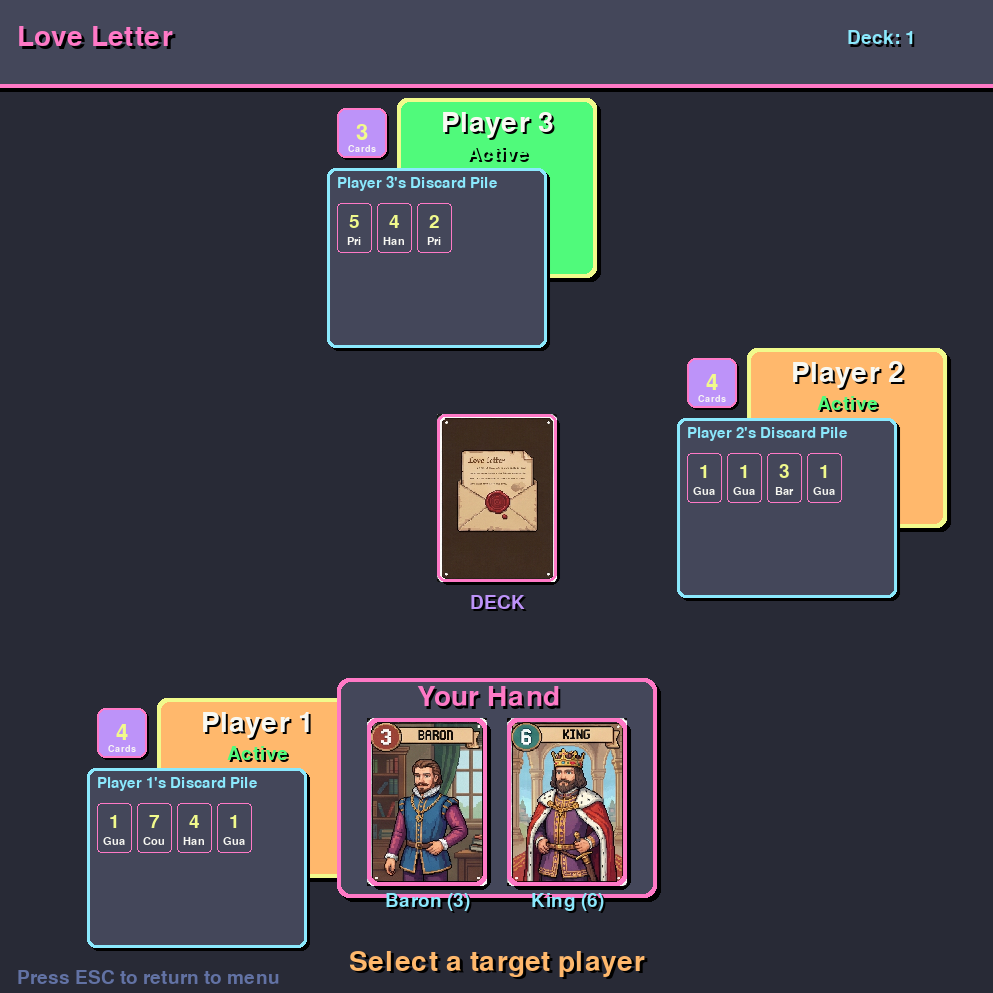

# Love Letter – Current State

**Description**  
Love Letter is a **multiplayer card game**. The game logic is implemented in Python, while the frontend will be built with React, JavaScript, HTML, and CSS. Players should then be able to **play directly in their browser** without downloading a separate client (future features).

**Technologies Used**  
- Python, Pygame  
- JavaScript, React  
- HTML, CSS  

**Current State**  
- The game is **fully playable with multiple players** over a LAN network using a local server.  
- Core gameplay mechanics are implemented.  
- Basic game logic and turn system are fully functional.  
- Players can interact with the game in real-time through the client interface connected to the local server. 
**Planned Features**  
- Complete the **GUI** for a polished user experience  
- Implement an **offline mode with bots**
- Finalize the **web interface**

**Screenshots / Images**  
Here are some screenshots showing the current state of the game:

  
  

**How to Run**  
```bash
git clone https://github.com/hoainam1401/Love_Letter.git
cd Love_Letter/Love_Letter_Base
python main.py